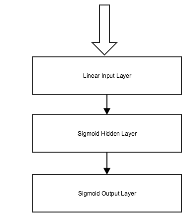

# Machine Learning Engineer Nanodegree
## Capstone Proposal
Andrew Smith
October 3rd 2017

## Proposal

### Domain Background

In the 1999 paper *Comparative accuracies of artificial neural networks and discriminant analysis in predicting forest cover types from cartographic variables (Blackard et al, Computers and Electronics in Agriculture 24, 1999)*, Blackard and Dean used an ANN with a single hidden layer of 120 units to predict forest cover type for data drawn from four wilderness areas with a predictive accuracy of 70.52%.

Since that paper was written a number of advances have been made in both hardware with the wide availability of GPUs suitable for use in ANNs and technique such as the use of RLUs, Dropout, Glorot Initializers and the wide use of Softmax Activation on the output layer, which have allowed the construction of ANNs with greatly improved accuracy. While these results are more well known in areas such as computer vision and natural language processing it is interesting to examine their impact on a simpler classification problem

### Problem Statement

As stated in the original paper *"Accurate natural resource inventory information is vital to any private, state, or federal land management agency. Forest cover type is one of the most basic characteristics recorded in such inventories. Generally, cover type data is either directly recorded by field personnel or estimated from remotely sensed data. Both of these techniques may be prohibitively time consuming and/or costly in some situations."* (Blackard et al 1999)

An ANN will be constructed and trained to preduct the coverage type based on the other available features. The accuracy of the new ANN constructed in the Blackard paper was 70.52%. It should be possible to improve upon this by constructing an ANN using the techniques mentioned above. A model similar to the one in the original paper can be constructed and its accuracy can be compared with the accuracy of the new model.

### Datasets and Inputs

The dataset used for this project will be the Forest Cover Type dataset available from the UCI Machine Learning Repository at http://archive.ics.uci.edu/ml/datasets/Covertype. It consists of 581,012 instances of data each with 54 attributes and one of 7 classifications. There is no missing data and the categorical items in the attributes are already one hot encoded. The data consists of 10 numerical features and 44 One Hot Encoded categorical features (4 types of wilderness area and 40 soil types). The data is quite heavily skewed towards two of the categories representing 83.22% of the data between them. The breakdown is as follows:

The data has 581012 rows
There are 211840 instances of Spruce/Fir representing 36.46% of the total
There are 283301 instances of Lodgepole Pine representing 48.76% of the total
There are 35754 instances of Ponderosa Pine representing 6.15% of the total
There are 2747 instances of Cottonwood/Willow representing 0.47% of the total
There are 9493 instances of Aspen representing 1.63% of the total
There are 17367 instances of Douglas-fir representing 2.99% of the total
There are 20510 instances of Krummholz representing 3.53% of the total

In the original study the training data was selected to ensure that equal proportions of the available data were used for training and validation. This severely limited the amount of data available for training. In this project the data will instead be stratified to ensure that each category is represented in the test and training data in proportions equal to their proportion in the overall data. This will maximise the data available for training.

The numerical data in the dataset will be scaled to values between 0 and 1 before training and evaluation.

### Solution Statement

A number of ANN models will be constructed. Each model will use 1 or more hidden layers. The input activation will be linear. The hidden layer activation will be ReLU and the output layer will use softmax. A Glorot Uniform Initializer will be used to initialize the unit weights. Nesterov Momentum will be used by the Stochastic Gradient Descent Optimizer and the loss function will be Categorical Cross Entropy.
The models will break into two classes. The first will use similar numbers of units per layer as seen in the original study, specifically 60, 120 or 240. The second class of model will use either 10, 20, 30 or 40 units *per variable in the data* so specifically 540, 1080, 1620 and 2160 units per layer. Each model will have 1 to 4 fully connected hidden layers. Each fully connected hidden layer will have a dropout rate of 0.5.

Each of these models will be trained against 80% of the original data. After training Its accuracy will be evaluated agains the remaining 20% with the goal of being able to accurately predict the Forest Coverage type from the available features.

In the original study 1000 Epochs were used to train the models. To keep the computing time to a manageable level this project will use just 100 Epochs for training.

### Benchmark Model
A model will be constructed which is close to the model used in the original study.
It will have a single hidden layer of 120 units. Both the hidden and output layers will use sigmoid activation functions. The Stochastic Gradient Descent Optimizer will use the same learning rate and momentum as in the original study (0.05 and 0.5) and the loss function will be mean squared error. As stated above this model will only be trained over 100 Epochs using 80% of the available data. The accuracy of the model will be evaluated against the remaining 20%. If this model is able to reach a level of accuracy comparable to that found in the original study then it will be suitable for use as a benchmark against which the solution models can be evaluated.

### Evaluation Metrics

The models will be evaluated based on their accuracy against held back testing data. Additionally the accuracy of each model against the training data will be evaluated to help identify instances where the model is overfitting.
Since the data is heavily sqewed then the accuracy of the most accurate model and benchmark model against unseen data of each individual category will also be evaluated.

### Project Design
A systematic exploration of the accuracy of models of varying complexity will be carried out against the available data. Each model will be trained and tested using the same data. Models with 60, 120, 240, 540, 1080, 1620 and 2160 units per layer, with a dropout rate of 0.5 applied to each layer and from 1 to 4 hidden layers in total will each be trained and evaluated against the available data. The models will each use the meta parameters mentioned in the solution statement.

The accuracy of each model against both the training and testing data will be tabulated so that the most effective model can be selected.

The most accurate model, and the benchmark model will then also be evaluated against each individual category

The models will be constructed using Keras with a Tensorflow back end. The code will be written to run on the FloydHub cloud machine learning solution. This will allow the models to be evaluated using high end GPUs and will allow the simultaneous evaluation of several models. Each model will produce an output report detailing it's evaluated accuracy and loss against both the training and testing data.

To enable the code to be evaluated locally without modification, the configuration for a docker image and the code to run it will be provided.

#### Example of a Solution ANN Architecture

The constructed models will be compared to a baseline model architected to resemble that used in the original study.

#### Original Study ANN Architecture

-----------

**Before submitting your proposal, ask yourself. . .**

- Does the proposal you have written follow a well-organized structure similar to that of the project template?
- Is each section (particularly **Solution Statement** and **Project Design**) written in a clear, concise and specific fashion? Are there any ambiguous terms or phrases that need clarification?
- Would the intended audience of your project be able to understand your proposal?
- Have you properly proofread your proposal to assure there are minimal grammatical and spelling mistakes?
- Are all the resources used for this project correctly cited and referenced?